# Java Script 
adalah bahasa pemograman yang paling populer karena banyak digunakan, js juga bisa dijalankan menggunakan WEB
>fitur yang didukung oleh js 
- crome
- mozila

## Syntax dan Statement
dianalogikan seperti kamus dan tatacara ( grammar ) pada bahasa pemograman 
> intruksi untuk menjalankan WEB
- alerr() = menampilkan sebuah pesan pringatan/ informasi
- prompt () = mengambil sebuah imputan dari pengguna
- confirm () = mealukan konfirmasi 
# console.log
sebuah printah untuk mengetahui printah benar atau tidak 
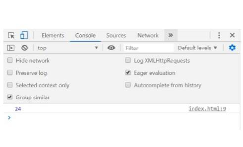

# Type data 
adalah klasifikasi yang kita berikan untuk berbagai macam data yang digunakan dalam programming.
> ada type data fundamental pada js
1. number
    
    tipe data yang mengandung semua angka termasuk angka desimal 
    
<b>contoh</b>
    
    let number1 = 12

    let number2 = 24
    
    let number3 = 24.12
2. string 

    karakter yang ada pada keyboard laptop yaitu huruf, angka, simbol dll

<b>contoh</b>

        let Sting = 'session 5 : belanar';
3. boolean

    tipe data yang hanya mempunyai 2 nilai  yaitu  TRUE  (benar) atau Flase (salah)

<b>contoh</b>

        let benar = true;
        let salah = flase;

4. null

    - adalah tipe data yang artinya sebuah variabel yang tidak memiliki nilai
    - null berbeda dengan string kosong, namun string kosong masih memiliki tipe data string

<b>contoh</b>

        let dataPertama = null;
        let dataKedua = null;
        let dataKetiga = "";

        console.log(dataPertama) ;
        console.log(dataKedua) ;
        console.log(dataKetiga) ;
berikut tampilan null yang ada di console
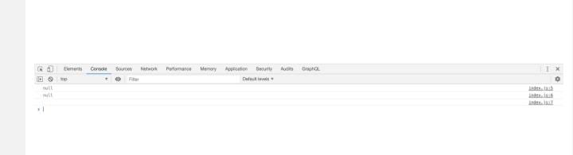

5. undefined

tipe data yang merepresentasikan variabel/data yang tidak memiliki nilai

<b>contoh</b>

    let a ="hactiv8";
    let b = "inalum"
    let peserta = ("david", "budi", "ryan")

    console.log(c)   // undefined
    console.log(a)   // hactiv8
    console.log(peserta.legth);  // 3
    console.log(peserta.panjangkarakter); //  undefined

    tanpilan undefined yang ada di console

 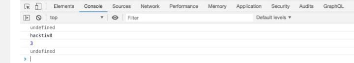

6. object

koleksi data yang saling berhubungan. tipe data object dapat menyimpan data dengan data apapun  ( number, string, bolean dan lain lain )

tipe data onject memiliki key dan value

 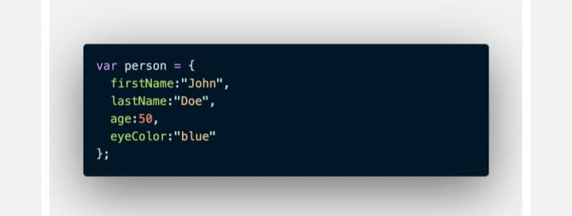

 # Variabel 
 adalah tempat untuk menyimpan sebuah nilai 
 > 3 hal yang dapat dilakukan pada variabel
 1. var
 2. let
 3. conts

 >var 
  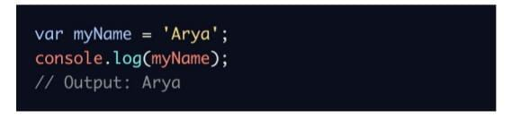

> let 
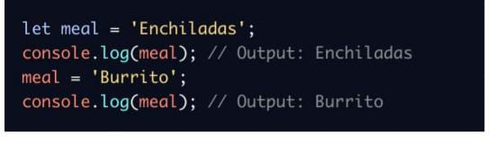

> conts

- digunakan jika variabel tidak dapat digunakan 
- biasanya digunakan untuk menggambarkan konstanta sebuah nilai seperti pi = 3.14
- nilai yang tidak dapat diubah (mutlak)
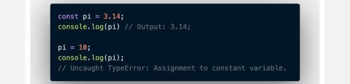

> bedanya let dan var yaitu untuk var = digunakan pada versi yang lama karena banyak kekurangan sedangkan let digunakan pada versi yang terbaru dan let sangat banyak digunakan

## Aturan Penamaan Variabel
1. harus mendiskripsikan temtang data yang di simpan ( bukan variabel coba-coba)
2. tidak bisa menggunakan nomor di awal penulisan
3. menggunkana camelcase untuk penamaan lebih dari 1 kata contohnya : (myName,myAge) dan lain lain 
## assigment oprator (=)

    let myName = "Ajie Prana";
    
> mathematical assigment oprator

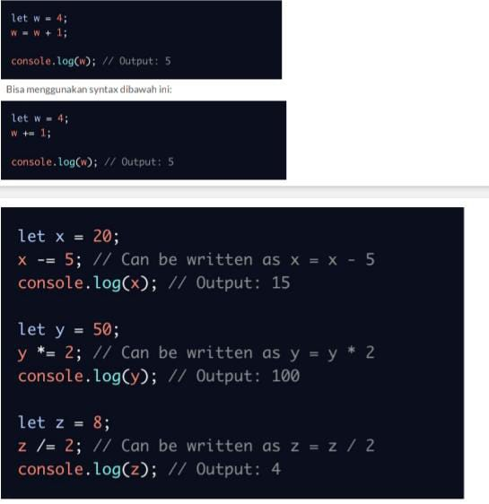

## Aritmetic oprator
oprator yang menibatkan oprasi oprator tambah, kurang, bagi, kali, dan modulud (+, -, *, /, %)

modulus hasil dari sisa bagi misalnya  5 % 2 adalah 1 ( karena 1 adalah sisa dari pembagian dari 5)

## Comparison Oprator
 prator yang membagikan satu nilai dengan nilai lainya, hasil oprasinya adalah antara true ata false
 ## Simbol Comparison Oprator
 - lebih kecil <
 - lebih besaqr >
 - lebih kecil atau sama dengan <=
 - lebih besar atau sama dengan >=
 - sama dengan ===
 - tidak sama dengan !==

 contoh penggunaan 
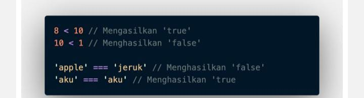

## Logical Oprator
digunakan untuk sebuah conditional pada pemograman, yang menghasilkan boolean true atau false

simbol logical oprator
> AND oprator &&

>OR oprator ||

> Not oprator !

# Function
bertujuan untuk dapat membuat code yang sama tampak melakukan perulangan berkali-kali 

> membuat function 

    function greeting(){
        return 'Hello World'
    }

>memanggil function 

    greeting()
    console.log(greeting);

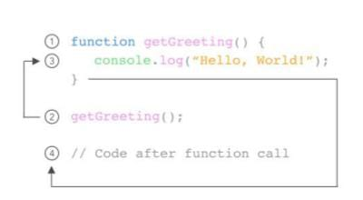

## parameter dan argumen 
> parameter function
- dapat menerima semua inputan  dengan menggunakan teks / tugas
- saat membuat function kita harus tahu data data yang dibutuhkan, misalnya membutuhkan 2 nilai,  berarti data yang dibutuhkan adalah 2 nilai tersebut 

        function penambahan (a,b){
            return a+b;
        }

> Argument function
- argument adalah nilai yang digunakan saat memanggil function 
- jumlah argumen harus sama dengan jumlah parameter
- jika melakukan pemambahan 2 parameter nilai saat membuat function, begitu juga saat memanggil function menggunakan 2 variabel 

        function penambahan (a,b){
            return a+b;
        }
        console.log(penambahan (5, 5))
        
        // outputnya 10
# js dan html DOM (Document Object Model)
>js dom 

adalah untuk memanipulasi tampilan WEB agar tampilan web lebih dinmamis ( lebih interaktif), js juga tidak berdiri sendiri dia juga harus menggunakan html dom 

> proses rendering dibalik layar
- html -> Parsing -> tokens -> dom (html akan memproses terlebih dahulu kemudian masing masig tag html itu akan menjadi dom)
- css -> Parsing -> tokens ->cssom(css akan memproses terlebih dahulu kemudian pecahan-pecahan code akan ada cssom)
- DOM + CSSOM = Render Tree ( kedua ini akan diproses dan menghasilkan render tree, dari hasil render tree baru memunculkan tampilan 

> isu terkait rendering 

jika saat proses parsing html di temukan tag "script" secara defult proses parsing akan dihentikan  samapai "script" tersebut selesai diunduh dan dijalankan 

##  contoh cara menggunakan DOM 

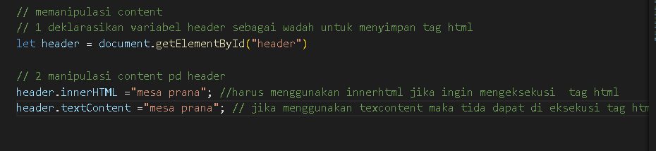